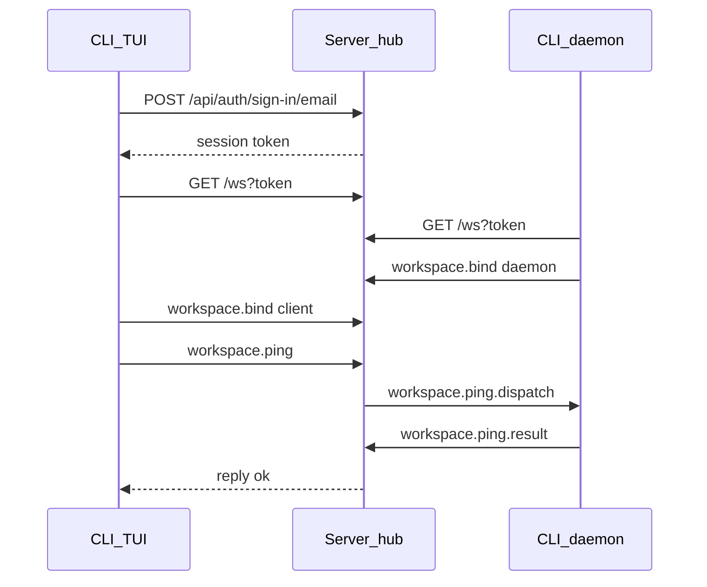

# Arquitectura

## Monorepo

- Gestor: **Bun** workspaces (`packages/*`).
- Paquetes: [`packages/cli`](../packages/cli) (TUI), [`packages/server`](../packages/server) (API + WS hub), [`packages/shared`](../packages/shared) (schemas).
- Scripts raíz: `dev:cli`, `dev:server`.

## Stack

| Capa | Tecnología |
|------|------------|
| Runtime | Bun ≥ 1.3 |
| UI | React 19 |
| TUI | `@opentui/core` + `@opentui/react` |
| API | Hono + Better Auth + Drizzle/Postgres |
| Wire | WebSocket hub (`GET /ws`) |
| JSX | `jsxImportSource: "@opentui/react"` (no DOM web) |

Los componentes JSX (`box`, `text`, `textarea`, `scrollbox`, …) son renderables de OpenTUI, no HTML.

## Auth y remote control (WS)

No hay socket directo entre web/TUI y el daemon. Ambos abren `GET /ws?token=...` contra el server.

1. **Auth HTTP** — el TUI muestra `LoginScreen` al arrancar (`AuthGate`): login (`POST /api/auth/sign-in/email`) o registro (`POST /api/auth/sign-up/email`, `Ctrl+R` para alternar). Session token en `~/.config/chavez/credentials.json`. En esa vista, doble `Ctrl+C` confirma la salida.
2. **HTTP posterior** — `Authorization: Bearer <token>`.
3. **WS** — mismo token en `?token=`; el upgrade valida con Better Auth (plugin `bearer` + cookie).
4. **Daemon** — `bun run headless workspace open <path>` (desde `packages/cli`) spawnea `features/workspace/daemon.ts`, hace `workspace.bind` (`clientKind: daemon`) y responde `workspace.ping.dispatch`.



Protocolo tipado en [`packages/shared/src/ws/protocol.ts`](../packages/shared/src/ws/protocol.ts). Hub en [`packages/server/src/ws/`](../packages/server/src/ws/).

El chat TUI sigue siendo echo local (`mockReply`) en este slice; el gate solo exige sesión.

## Stack local Docker

Simula un server remoto en local (CLI en el host, API/WS en contenedor):

| Servicio | Host | Contenedor |
|----------|------|------------|
| Postgres | `localhost:28000` | `db:5432` |
| Server (HTTP + WS) | `localhost:28001` | `server:3000` |

```bash
# packages/server/.env — copiar desde .env.example y poner BETTER_AUTH_SECRET
bun run docker:up          # build + up -d
curl http://localhost:28001/health
CHAVEZ_API_URL=http://localhost:28001 bun run dev:cli
bun run docker:down
```

Compose: [`packages/server/docker-compose.yml`](../packages/server/docker-compose.yml). El entrypoint del server corre `db:migrate` y luego `bun run start`.

## Layout actual

Una sola columna (tras login):

```
┌─────────────────────────────────────┐
│ StatusBar (marca · modos · hints)   │
├─────────────────────────────────────┤
│ MessageList (scroll, sticky bottom) │
│ CommandMenu (si el prompt empieza /)│
│ Prompt (altura dinámica ≤ 25%)      │
└─────────────────────────────────────┘
```

## Mapa de fuentes

| Ruta | Rol |
|------|-----|
| `cli/src/app/` | Bootstrap, routes, Shell |
| `cli/src/features/auth/api/` | Credenciales, sign-in/up HTTP |
| `cli/src/features/auth/ui/` | AuthGate, LoginScreen |
| `cli/src/features/chat/` | `pane/`, `input/`, `chrome/`, `dialogs/` + `tests/` |
| `cli/src/features/session/` | Store in-memory, handlers, mock reply + `tests/` |
| `cli/src/features/workspace/` | `ws/` (client, reconnect, daemon), headless + `tests/` |
| `cli/src/lib/` | Registry, providers, types; tests en `tests/` / `providers/tests/` |
| `server/src/ws/` | hub, handlers, pending, heartbeat |
| `server/src/routes/ws.ts` | Upgrade autenticado |
| `shared/src/ws/protocol.ts` | Schemas Zod del wire |

## Referencia OpenTUI

Skills locales (API y snippets):

- `packages/cli/.cursor/skills/opentui-components/`
- `packages/cli/.cursor/skills/opentui-react/`
- `packages/cli/.cursor/skills/opentui-testing/`
