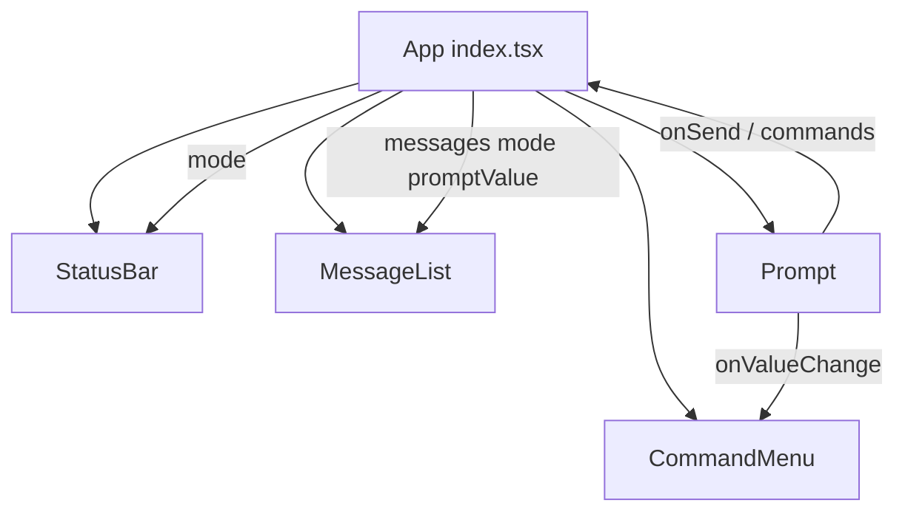

# Arquitectura

## Monorepo

- Gestor: **Bun** workspaces (`packages/*`).
- Paquete activo: [`packages/cli`](../packages/cli) (`@chavez-harness/cli`).
- Script raíz: `dev:cli` → `bun run --watch packages/cli/src/index.tsx`.

## Stack

| Capa | Tecnología |
|------|------------|
| Runtime | Bun ≥ 1.3 |
| UI | React 19 |
| TUI | `@opentui/core` + `@opentui/react` |
| JSX | `jsxImportSource: "@opentui/react"` (no DOM web) |

Los componentes JSX (`box`, `text`, `textarea`, `scrollbox`, …) son renderables de OpenTUI, no HTML.

## Layout actual

Una sola columna:

```
┌─────────────────────────────────────┐
│ StatusBar (marca · modos · hints)   │
├─────────────────────────────────────┤
│ MessageList (scroll, sticky bottom) │
│ CommandMenu (si el prompt empieza /)│
│ Prompt (altura dinámica ≤ 25%)      │
└─────────────────────────────────────┘
```

## Componentes y estado



Estado principal en `App`:

| Estado | Rol |
|--------|-----|
| `messages` | Lista echo `{ id, text, mode }` |
| `mode` | `"plan"` \| `"build"` (Tab) |
| `promptValue` | Texto vivo del prompt (filtra comandos) |
| `selectedCommandIndex` | Índice en el menú `/` |

## Mapa de fuentes (`packages/cli/src`)

| Ruta | Rol |
|------|-----|
| `index.tsx` | Root, teclado Tab, wiring |
| `components/StatusBar.tsx` | Marca + chips Plan/Build |
| `components/MessageList.tsx` | Historial echo |
| `components/CommandMenu.tsx` | Lista scrollable de `/` |
| `components/Prompt.tsx` | Input, altura dinámica |
| `registry/shortcuts.ts` | Atajos de teclado |
| `registry/commands.ts` | Catálogo de comandos |
| `constants/filter-commands.tsx` | Filtro por query |
| `types/commands.tsx` | `Command` / `CommandContext` |

## Referencia OpenTUI

Skills locales (API y snippets):

- `packages/cli/.cursor/skills/opentui-components/`
- `packages/cli/.cursor/skills/opentui-react/`
- `packages/cli/.cursor/skills/opentui-testing/`
