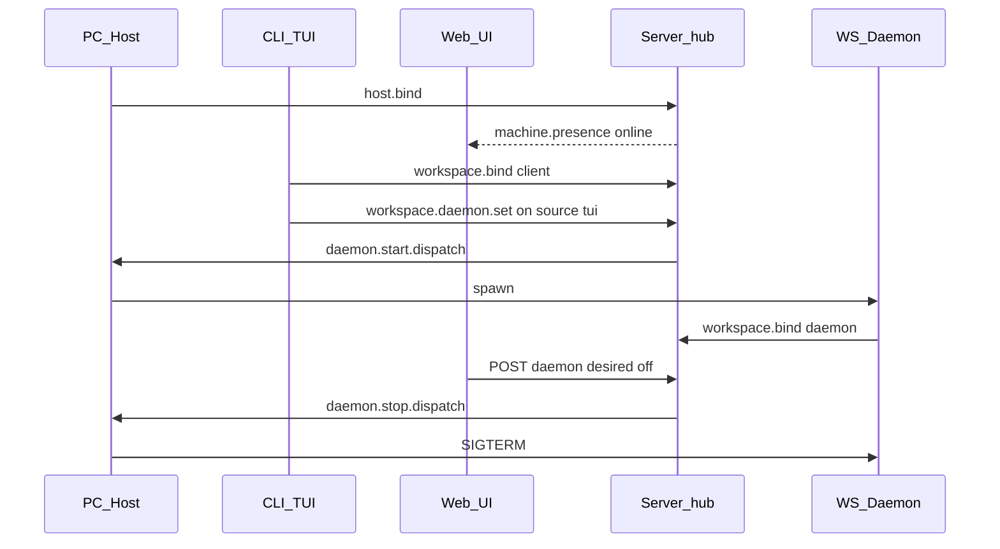
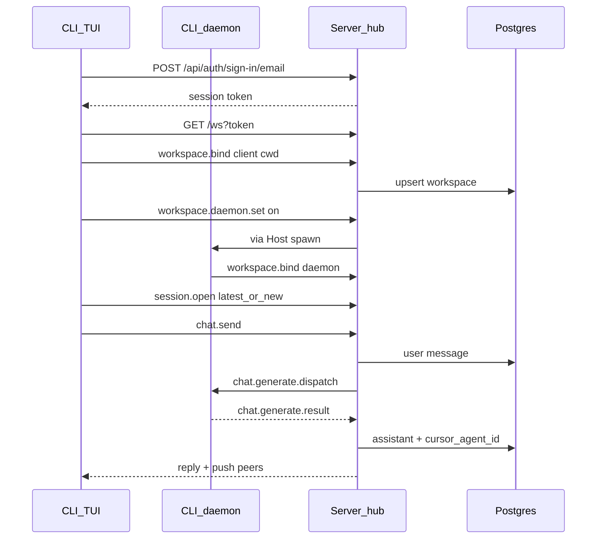

# Arquitectura

## Monorepo

- Gestor: **Bun** workspaces (`packages/*`).
- Paquetes: [`packages/cli`](../packages/cli) (TUI), [`packages/server`](../packages/server) (API + WS hub), [`packages/shared`](../packages/shared) (schemas).
- Scripts raíz: `dev:cli`, `dev:server`.

## Stack

| Capa | Tecnología |
|------|------------|
| Runtime | Bun ≥ 1.3 |
| UI | React 19 |
| TUI | `@opentui/core` + `@opentui/react` |
| API | Hono + Better Auth + Drizzle/Postgres |
| Wire | WebSocket hub (`GET /ws`) + REST `/api/workspaces|sessions` |
| JSX | `jsxImportSource: "@opentui/react"` (no DOM web) |

Los componentes JSX (`box`, `text`, `textarea`, `scrollbox`, …) son renderables de OpenTUI, no HTML.

## Auth, workspace y chat sync

No hay socket directo entre web/TUI y el daemon. Ambos abren `GET /ws?token=...` contra el server. El **server es la fuente de verdad** de workspaces, chat sessions y mensajes.

Providers LLM: API keys cifradas en `user_provider_credential` (AES-GCM). Seed puede cargar `CURSOR_API_KEY`; el TUI usa `/connect`.

| Provider | Dónde corre | Runtime |
|----------|-------------|---------|
| `local` | server | echo mock |
| `cursor` | daemon (`chat.generate.*`) | `@cursor/sdk` con `local: { cwd }` + `Agent.resume` entre turns (`chat_session.cursor_agent_id`) |
| `openai` / `antropic` / `grok` | (futuro) server | AI SDK `generateText` / API directa — aún stubs |

Defaults de sesión nueva: **provider `cursor`**, **model `auto`**. Sin API key → error pidiendo `/connect`.

1. **Auth HTTP** — el TUI muestra `LoginScreen` al arrancar (`AuthGate`): login (`POST /api/auth/sign-in/email`) o registro (`POST /api/auth/sign-up/email`, `Ctrl+R` para alternar). Session token en `~/.config/chavez/credentials.json`. En esa vista, doble `Ctrl+C` confirma la salida.
2. **HTTP posterior** — `Authorization: Bearer <token>`.
3. **WS** — mismo token en `?token=`; el upgrade valida con Better Auth (plugin `bearer` + cookie).
4. **Host (PC)** — proceso latente (`clientKind: host`) que reporta máquina online. Arranca con el TUI (`ensureHost`) o `bun run headless workspace host`. Lock en `~/.config/chavez/host.pid`.
5. **Workspace bootstrap (TUI)** — tras login, `WorkspaceConnection` conecta WS, asegura Host, hace `workspace.bind` (`clientKind: client`) con `process.cwd()`, pone `daemon_desired=on` (source `tui`) vía `workspace.daemon.set`, y abre la última `chat_session` o crea una. Al salir del TUI: cierra el client y pide `desired=off` solo si no está pinned por web.
6. **Daemon on-demand** — el Host recibe `daemon.start/stop.dispatch` y spawnea/mata el proceso por path (lockfile en `~/.config/chavez/daemons/`). También: `bun run headless workspace open <path>`.
7. **Web** — `GET /api/machine` valida PC online antes de entrar a workspaces; `POST /api/workspaces/:id/daemon` activa/desactiva (source `web`, pin hasta Desactivar).
8. **Chat** — `chat.send` (WS) o `POST /api/sessions/:id/messages` (REST): `local` = echo mock; `cursor` = `@cursor/sdk` en daemon con continuidad vía `Agent.resume` (`cursor_agent_id`).

Flujo Host + daemon:



Flujo Cursor (LLM):

1. CLI `chat.send` con sesión cursor/auto
2. Server persiste user msg → `chat.generate.dispatch` (incluye `agentId` si ya hay)
3. Daemon unwrap job → `Agent.create` o `Agent.resume` → `send` → `chat.generate.result` (`text` + `agentId`)
4. Server persiste `cursor_agent_id` + assistant msg → reply al CLI



**Naming:** la tabla Better Auth `session` es la sesión de autenticación. Las conversaciones viven en `chat_session` / `chat_message`.

Protocolo tipado en [`packages/shared/src/ws/protocol.ts`](../packages/shared/src/ws/protocol.ts). Hub en [`packages/server/src/ws/`](../packages/server/src/ws/). Servicios compartidos REST/WS: [`packages/server/src/services/chat.ts`](../packages/server/src/services/chat.ts).

Indicador TUI (StatusBar): **Desconectado** / **Conectado** (WS+bind) / **Sincronizado** (Host online + daemon online).

Defaults mock: `provider=local`, `model=eco`.

## Modelo de datos (app)

| Tabla | Rol |
|-------|-----|
| `workspace` | Path absoluto por usuario; unique `(user_id, path)`; `daemon_desired` / `daemon_desired_source` (latente on/off) |
| `chat_session` | Varias por workspace; mode/provider/model |
| `chat_message` | `parts` jsonb, `seq` monotónico, `client_message_id` opcional (idempotencia) |

## Stack local Docker

Simula un server remoto en local (CLI en el host, API/WS en contenedor):

| Servicio | Host | Contenedor |
|----------|------|------------|
| Postgres | `localhost:28000` | `db:5432` |
| Server (HTTP + WS) | `localhost:28001` | `server:3000` |

```bash
# packages/server/.env — copiar desde .env.example y poner BETTER_AUTH_SECRET
bun run docker:up          # build + up -d
curl http://localhost:28001/health
CHAVEZ_API_URL=http://localhost:28001 bun run dev:cli
bun run docker:down
```

Compose: [`packages/server/docker-compose.yml`](../packages/server/docker-compose.yml). El entrypoint del server corre `db:migrate` y luego `bun run start`.

## Layout actual

Una sola columna (tras login):

```
┌─────────────────────────────────────┐
│ StatusBar (marca · link · sesión)   │
├─────────────────────────────────────┤
│ MessageList (scroll, sticky bottom) │
│ CommandMenu (si el prompt empieza /)│
│ Prompt (altura dinámica ≤ 25%)      │
└─────────────────────────────────────┘
```

## Mapa de fuentes

| Ruta | Rol |
|------|-----|
| `cli/src/app/` | Bootstrap, routes, Shell |
| `cli/src/features/auth/api/` | Credenciales, sign-in/up HTTP |
| `cli/src/features/auth/ui/` | AuthGate, LoginScreen |
| `cli/src/features/chat/` | `pane/`, `input/`, `chrome/`, `dialogs/` + `tests/` |
| `cli/src/features/session/` | Handlers React Router + mapeo DTO → turns |
| `cli/src/features/workspace/` | Bridge WS, Host, daemon, lockfiles, WorkspaceConnection |
| `cli/src/lib/` | Registry, providers, types; tests en `tests/` / `providers/tests/` |
| `server/src/services/` | WorkspaceService + ChatService |
| `server/src/routes/api.ts` | REST autenticado |
| `server/src/ws/` | hub, handlers, pending, heartbeat |
| `server/src/db/chat/` | Schema Drizzle workspace/chat |
| `shared/src/ws/protocol.ts` | Schemas Zod del wire |
| `shared/src/schemas/chat.schema.ts` | DTOs de chat |

## Referencia OpenTUI

Skills locales (API y snippets):

- `packages/cli/.cursor/skills/opentui-components/`
- `packages/cli/.cursor/skills/opentui-react/`
- `packages/cli/.cursor/skills/opentui-testing/`
