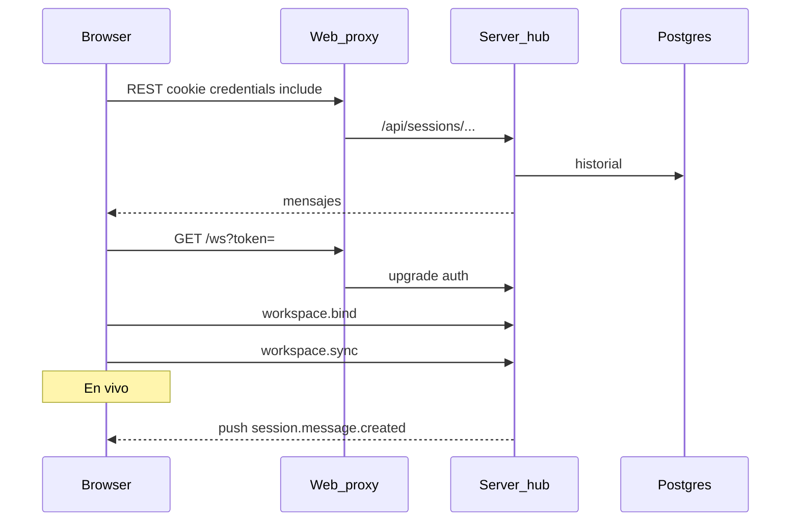

# Ops: sync en tiempo real (web / TUI / hub)

Guía operativa para multi-dispositivo y producción. Complementa [architecture.md](./architecture.md).

## Qué significa «En vivo» / «Sin sync»

En la web (`ChatPage`, vía el socket compartido de `useChavezSocket`), el badge **no** es un campo de `chat_session` en Postgres. Es estado **local a la pestaña**:

| Badge | Significado |
|-------|-------------|
| **En vivo** | Este navegador completó `WS connect → workspace.bind → workspace.sync` |
| **Conectando…** | Socket abriéndose o rebind tras un drop |
| **Sin sync** | Falló connect, auth WS, bind o sync en **este** tab |

Dos dispositivos con la misma URL pueden diferir: A «En vivo» y B «Sin sync» significa que B no está enlazado al hub, no que la sesión “esté offline” en el server.

El TUI usa etiquetas distintas (**Desconectado** / **Conectado** / **Sincronizado**). **Sincronizado** exige además Host online + daemon online; la web **no** exige eso para mostrar «En vivo».

## Flujo REST vs WebSocket

- **REST** — fuente de verdad persistida (historial, CRUD). Auth: cookie Better Auth (`credentials: "include"`).
- **WS** (`GET /ws`) — hub in-memory: bind por workspace, fan-out `broadcastToWorkspace`. Auth: cookie, `Authorization: Bearer`, o `?token=` ([`packages/server/src/ws/auth.ts`](../packages/server/src/ws/auth.ts)).
- No hay socket directo web↔daemon; todo pasa por el server.

La web guarda un token en `sessionStorage` (`chavez.sessionToken`) para `?token=` y lo rehidrata con `ensureSessionToken()` (sesión Better Auth / cookie legible) porque algunos proxies no reenvían bien la cookie en el upgrade WS aunque el REST funcione.

## Multi-dispositivo misma URL (LAN / IP)

Escenario típico: `http://192.168.x.x:4321` en PC y teléfono.

1. Cada browser inicia sesión (cookie jar propio).
2. `ALLOW_PRIVATE_NETWORK_ORIGINS` (default `true` si `WEB_URL` es `http://`) acepta Origins HTTP en RFC1918 **con el mismo puerto** que `WEB_URL`.
3. Opcional: `TRUSTED_ORIGINS=http://192.168.x.x:4321` si desactivas el allowlist privado.
4. `WEB_URL` / `BETTER_AUTH_URL` deben ser el origen que ve el browser (o al menos compatible con trusted origins). En LAN por IP, conviene poner la IP en `TRUSTED_ORIGINS` o usar `ALLOW_PRIVATE_NETWORK_ORIGINS=true`.

## Proxy same-origin

Recomendado: el browser solo habla con el origen de la web; Astro/Vite proxea `/api` y `/ws`.

| Entorno | Proxies |
|---------|---------|
| Dev | Vite en [`packages/web/astro.config.mjs`](../packages/web/astro.config.mjs) (`ws: true`) |
| Prod Node | [`packages/web/scripts/serve.mjs`](../packages/web/scripts/serve.mjs) — upgrade `/ws` → `API_INTERNAL_URL` |

- `API_INTERNAL_URL` — upstream del API (p. ej. `http://localhost:28001` o servicio Docker).
- `PUBLIC_API_URL` — vacío = same-origin. Si apuntas cross-origin, las cookies same-site no viajan; hace falta `?token=` (login debe guardar token).

## Hub in-memory

El hub WS vive en memoria del proceso server ([`packages/server/src/ws/hub.ts`](../packages/server/src/ws/hub.ts)).

**Producción:** un solo proceso de API/WS, o varias réplicas **con sticky sessions** hacia el mismo proceso. Sin sticky, binds y broadcasts se parten: un dispositivo “En vivo” y otro no, o pushes asimétricos.

## Checklist de entorno (prod / LAN)

| Variable | Notas |
|----------|--------|
| `WEB_URL` | Origen público del front (CORS + better-auth `baseURL`) |
| `BETTER_AUTH_URL` | Default ≈ `WEB_URL`; no uses el puerto interno del API |
| `SERVER_URL` | URL pública del API (CLI / docs) |
| `TRUSTED_ORIGINS` | CSV de orígenes extra (p. ej. IP LAN) |
| `ALLOW_PRIVATE_NETWORK_ORIGINS` | LAN HTTP; default true si `WEB_URL` es http |
| `API_INTERNAL_URL` | Solo en el proceso web: target del proxy |
| Cookies `secure` | Solo si `WEB_URL` es `https://` |

Ver comentarios en [`packages/server/.env.example`](../packages/server/.env.example) y [`packages/web/.env.example`](../packages/web/.env.example).

## Troubleshooting

**Historial OK + «Sin sync»**

1. DevTools → Network → WS: ¿101 o 401?
2. ¿La URL del WS incluye `?token=` tras login / recarga?
3. ¿Origin permitido? (`TRUSTED_ORIGINS` / puerto LAN)
4. ¿Proxy reenvía upgrade `/ws`? (prod: `serve.mjs`; contenedor: `API_INTERNAL_URL` alcanzable)
5. Mensaje de error bajo el badge (ya no se traga el fallo en silencio)
6. Error `crypto.randomUUID is not a function` en consola → HTTP por **IP** (contexto no seguro). `randomUUID` solo existe en `https://` / `localhost`; en LAN HTTP el cliente web usa `randomId()` (`getRandomValues`). Si aún ves el error, recarga tras desplegar ese fix.

**Web «En vivo» vs TUI «Conectado» (no Sincronizado)**

Esperado si Host o daemon están offline: la web no exige Host/daemon para el badge.

**Tras dropear red**

El badge debe pasar a «Conectando…» y, tras reconnect + rebind, volver a «En vivo». Si queda «En vivo» sin pushes, reportar como regresión del cliente WS.

## Checklist pre-producción

- [ ] Dos browsers (o PC + móvil) con **la misma URL**; ambos login.
- [ ] Ambos abren la misma sesión de chat → ambos **En vivo**.
- [ ] Mensaje desde A aparece en B **sin** reload (y viceversa).
- [ ] Cortar red / matar WS en DevTools → badge baja; al recuperar → **En vivo** otra vez.
- [ ] Un solo proceso de hub (o sticky) documentado en el deploy.
- [ ] `WEB_URL` / trusted origins / proxy `/ws` verificados en el entorno real (no solo localhost).
